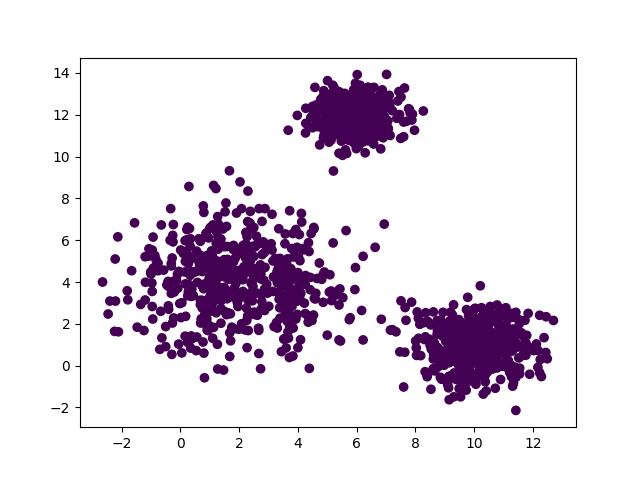
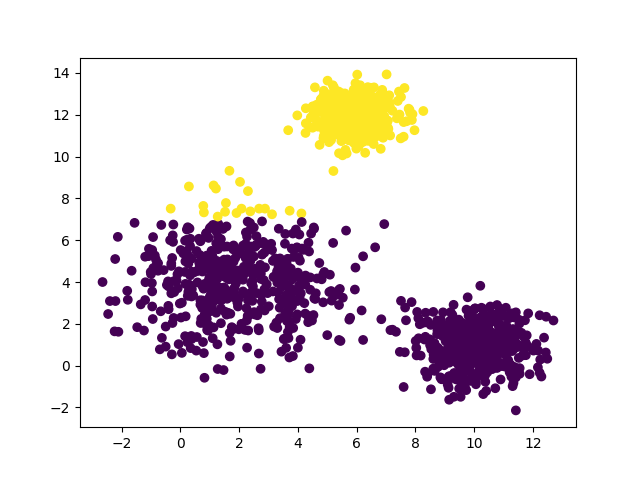
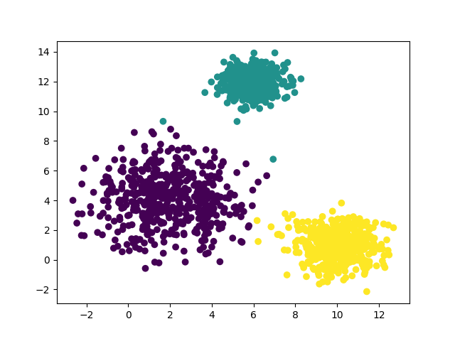

# Kell-Means
This is a clustering algorithm that expands on the standard K-Means. It is inspired by the way that cells reproduce by
splitting into two new cells, hence the name Kell-Means.
<table>
    <tr>
        <th>Iteration 1</th>
        <th>Iteration 2</th>
        <th>Iteration 3</th>
    </tr>
    <tr>
        <td></td>
        <td></td>
        <td></td>
    </tr>
</table>

## How to use
To use this code you can import the KellMeans file into any project and use it with:

`km = KellMeans()` - Creates a KellMeans object 
`km.fitData(data)` - Runs the algorithm over the data 
`km.display()` - Prints information about the centroids and labels 
`plt.scatter(x, y, c=km.labels)` - Plots the points onto a MatPlotLib scatter graph 
`plt.show()` - Shows the scatter graph 

The algorithm is currently only setup to work on 2-dimensional data, I plan on updating it in the future but have no
timeline for this.

## Breakdown of process
1. Creates 1 centroid randomly in the data boundaries.
2. Runs the K-Means algorithm until centroid/s converge.
3. Checks each centroid for imbalances in data distribution along each axis such as multiple peaks, indicating there are two clusters in one centroid.
4. If any imbalances are found it creates a new centroid shifted slightly from its position and goes back to step 2, else it finishes.

## Libraries used
- Numpy
- MatPlotLib
- Math
- Random
- Operator